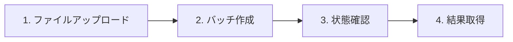

# バッチ推論 ユーザーマニュアル

## はじめに

### バッチ推論とは

バッチ推論は、大量のリクエストを非同期で処理する機能である。通常の Chat Completions API は 1 リクエストごとに同期的に応答を返すが、バッチ推論では複数リクエストをまとめて投入し、バックグラウンドで順次処理される。処理完了後に結果ファイルを取得する形で利用する。

### OpenAI Batch API との互換性

本 API は [OpenAI Batch API](https://platform.openai.com/docs/api-reference/batch) と互換のインターフェースを提供する。OpenAI 公式の Python SDK（`openai` パッケージ）をそのまま利用できる。

### 利用シーン

- 大量のテキストの分類・タグ付け
- 複数ドキュメントの要約
- 一括翻訳
- バルクでの感情分析・キーワード抽出
- 非同期で長時間かかる推論の一括実行

---

## 前提条件

- **API キー**: 管理者から発行された API キーを取得していること
- **利用可能モデル**: バッチ推論で利用可能なモデル一覧は管理者に確認すること（通常の Chat Completions 用モデルとは別設定の可能性がある）。現在提供しているモデルの一覧として、**openai/gpt-oss-20b** が提供されている。
- **ベース URL**: プロキシのベース URL（`https://api.maas.mdx1.jp/v1`）を確認すること

---

## 認証

すべてのリクエストには API キーによる認証が必要である。HTTP ヘッダーに Bearer トークン形式で指定する。

```
Authorization: Bearer <your-api-key>
```

### OpenAI Python SDK での設定

```python
from openai import OpenAI

client = OpenAI(
    base_url="https://api.maas.mdx1.jp/v1",  # プロキシのベース URL
    api_key="your-api-key",
)
```

---

## 利用フロー

バッチ推論は以下の 4 ステップで行う。



| ステップ | 内容 |
|----------|------|
| 1. ファイルアップロード | 入力 JSONL をアップロードし、`file_id` を取得する |
| 2. バッチ作成 | `file_id` を指定してバッチジョブを作成し、`batch_id` を取得する |
| 3. 状態確認 | `batch_id` でステータスをポーリングし、`completed` になるまで待つ |
| 4. 結果取得 | `output_file_id` と `error_file_id` から結果をダウンロードする |

---

## 入力ファイル形式（JSONL）

入力ファイルは JSONL（1 行 1 JSON）形式である。1 行が 1 リクエストに対応する。

### 必須フィールド

| フィールド | 説明 | 値 |
|------------|------|-----|
| `custom_id` | 一意の ID。結果の行と対応づけるために必須。各行で重複不可 | 任意の文字列 |
| `method` | HTTP メソッド | `"POST"` 固定 |
| `url` | エンドポイント | `"/v1/chat/completions"` 固定 |
| `body` | Chat Completions のリクエストボディ | `model` と `messages` が必須 |

### body の必須項目

- **model**: バッチ用に設定されたモデル名（例: `openai/gpt-oss-20b`）
- **messages**: チャットメッセージの配列（`role` と `content` を持つオブジェクトの配列）

### 入力例

```jsonl
{"custom_id": "req-001", "method": "POST", "url": "/v1/chat/completions", "body": {"model": "openai/gpt-oss-20b", "messages": [{"role": "user", "content": "プランク定数について教えてください。"}]}}
{"custom_id": "req-002", "method": "POST", "url": "/v1/chat/completions", "body": {"model": "openai/gpt-oss-20b", "messages": [{"role": "user", "content": "オイラーの公式について教えてください。"}]}}
{"custom_id": "req-003", "method": "POST", "url": "/v1/chat/completions", "body": {"model": "openai/gpt-oss-20b", "messages": [{"role": "system", "content": "あなたは専門家です。"}, {"role": "user", "content": "量子力学の基礎を簡潔に説明してください。"}]}}
```

---

## コード例

### OpenAI Python SDK 使用例

```python
import io
import json
import time
from openai import OpenAI

BASE_URL = "https://api.maas.mdx1.jp/v1"
API_KEY = "your-api-key"
MODEL = "openai/gpt-oss-20b"

client = OpenAI(base_url=BASE_URL, api_key=API_KEY)

# 1. 入力 JSONL を生成してアップロード
requests = [
    {
        "custom_id": "req-001",
        "method": "POST",
        "url": "/v1/chat/completions",
        "body": {
            "model": MODEL,
            "messages": [{"role": "user", "content": "こんにちは"}],
        },
    },
]
jsonl_content = "\n".join(json.dumps(r, ensure_ascii=False) for r in requests)

file_obj = client.files.create(
    file=("batch_input.jsonl", io.BytesIO(jsonl_content.encode("utf-8")), "application/jsonl"),
    purpose="batch",
)
file_id = file_obj.id

# 2. バッチ作成
batch = client.batches.create(
    input_file_id=file_id,
    endpoint="/v1/chat/completions",
    completion_window="24h",
)
batch_id = batch.id

# 3. 完了までポーリング
while True:
    batch = client.batches.retrieve(batch_id)
    if batch.status == "completed":
        break
    if batch.status in ("failed", "cancelled", "expired"):
        raise RuntimeError(f"Batch ended with status: {batch.status}")
    time.sleep(10)

# 4. 結果取得
output_content = client.files.content(batch.output_file_id).read().decode("utf-8")
for line in output_content.strip().split("\n"):
    if line:
        obj = json.loads(line)
        custom_id = obj["custom_id"]
        body = obj["response"]["body"]
        content = body["choices"][0]["message"]["content"]
        print(f"{custom_id}: {content}")
```

### curl 使用例

```bash
# 環境変数
BASE_URL="https://api.maas.mdx1.jp/v1"
API_KEY="your-api-key"

# 1. ファイルアップロード
FILE_ID=$(curl -s -X POST "${BASE_URL}/files" \
  -H "Authorization: Bearer ${API_KEY}" \
  -F "file=@batch_input.jsonl" \
  -F "purpose=batch" | jq -r '.id')

# 2. バッチ作成
BATCH_ID=$(curl -s -X POST "${BASE_URL}/batches" \
  -H "Authorization: Bearer ${API_KEY}" \
  -H "Content-Type: application/json" \
  -d "{\"input_file_id\": \"${FILE_ID}\", \"endpoint\": \"/v1/chat/completions\", \"completion_window\": \"24h\"}" | jq -r '.id')

# 3. 状態確認（ポーリング）
# GET ${BASE_URL}/batches/${BATCH_ID}

# 4. 結果取得（status が completed になったら）
# GET ${BASE_URL}/files/${OUTPUT_FILE_ID}/content
```

---

## バッチのステータス一覧

| ステータス | 説明 |
|------------|------|
| validating | 入力ファイルの検証中 |
| in_progress | 推論処理中 |
| completed | 完了。`output_file_id` と `error_file_id` が返る |
| failed | 失敗（入力形式エラー、モデル未定義など） |
| cancelled | ユーザーによりキャンセル済み |
| expired | 有効期限（24 時間）切れ |

`request_counts` で `total`、`completed`、`failed` の件数を確認できる。

---

## 出力形式

### 成功時（output ファイル）

各行は以下の形式の JSON である。

```json
{
  "id": "batch_req_xxx",
  "custom_id": "req-001",
  "response": {
    "status_code": 200,
    "request_id": "batch_req_xxx",
    "body": {
      "id": "chatcmpl-xxx",
      "object": "chat.completion",
      "choices": [{"message": {"role": "assistant", "content": "応答テキスト"}}],
      "usage": {"prompt_tokens": 10, "completion_tokens": 20, "total_tokens": 30}
    }
  },
  "error": null
}
```

`response.body` が Chat Completions API のレスポンス形式である。

### 失敗時（error ファイル）

失敗したリクエストは error ファイルに出力される。

```json
{
  "id": "batch_req_xxx",
  "custom_id": "req-002",
  "response": null,
  "error": {
    "code": "request_failed",
    "message": "エラーメッセージ"
  }
}
```

---

## バッチのキャンセル

処理中のバッチをキャンセルするには、以下の API を呼ぶ。

```
POST /v1/batches/{batch_id}/cancel
```

`validating` または `in_progress` のときのみキャンセル可能である。`completed`、`failed`、`cancelled`、`expired` の状態ではキャンセルできない。

---

## 処理中トークン上限（batch_pending_token_limit）

API キーごとに「処理中・処理待ちの入力トークン数の合計」の上限を設けている場合がある。この上限は**バッチ用ウィンドウ上限（後述）や Chat 用ウィンドウ上限とは別**の設定である。

### 仕様

- **対象**: ある時点で、その API キーが「処理中」または「処理待ち」で占有している**入力（プロンプト）トークン数**の合計。
- **カウント対象**: ステータスが `validating`・`in_progress`・`cancelling` のバッチに含まれるリクエストの入力トークン合計。
- **解放**: バッチが `completed`・`failed`・`cancelled`・`expired` になると、そのバッチのトークンは合計から外れる（1 件ずつ完了するごとに占有は減っていく）。
- **チェックタイミング**: バッチ作成（`POST /v1/batches`）時に、「現在の使用量 ＋ 新規バッチの入力トークン合計」が上限を超えていないか判定する。超えている場合は **429 Too Many Requests** が返る。
- **上限の設定**: 管理者が API キーごとに `batch_pending_token_limit` を設定する。未設定（NULL）の場合は無制限である。

### 429 が返った場合

レスポンスの `detail` に、現在の使用量・新規バッチのトークン数・上限値が含まれる。対処例は次のとおり。

- 既存バッチの完了を待ってから再度バッチを作成する
- 入力ファイルの行数や 1 リクエストあたりのトークン数を減らし、新規バッチのトークン数を抑える

---

## バッチ用ウィンドウ上限（短期 / 長期）

「処理中トークン上限」とは別に、API キーごとに**直近一定期間のバッチ推論で消費したトークン合計**に対する上限が設定されている場合がある。これは Chat Completions API 側の同種の上限とは独立に管理される。

### 仕様

- **対象**: バッチ推論ワーカーがリクエストごとに記録する `total_tokens`（input + output）の合計。
- **集計期間**: 以下の 2 つのスライディングウィンドウを同時に判定する。
  - **短期ウィンドウ**: 直近 N 時間（既定 3 時間）
  - **長期ウィンドウ**: 直近 N 日（既定 7 日）
- **チェックタイミング**: バッチ作成（`POST /v1/batches`）時に、認証 API キーの「これまでのバッチ推論使用量」が短期 / 長期それぞれの上限を超えていないか判定する。どちらか一方でも上限以上に達していれば、その時点で **429 Too Many Requests** が返り、バッチは作成されない。
- **対象のリクエスト**: バッチ推論ワーカーが完了させたリクエストの `total_tokens` のみが集計される。Chat Completions API の使用量は含まれない。
- **判定の性質**: 既存使用量で判定するリアクティブ方式（新規バッチのトークン数は加算しない）。Chat 側のウィンドウ上限と同じ挙動である。
- **上限の設定**: 管理者が API キーごとに `batch_short_window_token_limit` / `batch_long_window_token_limit` を設定する。未設定（NULL）の場合は無制限である。ウィンドウ幅も管理者の設定に依存する。

### 429 が返った場合

レスポンスの `detail` に、どちらのウィンドウを超過したかと現在の使用量・上限値が含まれる。

- **短期ウィンドウ超過**:

    ```json
    {
      "detail": "Batch short-window (3h) token limit exceeded. Current: 250000, Limit: 200000"
    }
    ```

- **長期ウィンドウ超過**:

    ```json
    {
      "detail": "Batch long-window (7d) token limit exceeded. Current: 2500000, Limit: 2000000"
    }
    ```

対処例:

- 短期ウィンドウ超過の場合、時間が経つほど古い使用量がウィンドウから外れるため、数時間待ってから再投入する
- バッチ投入前に `GET /v1/usage` で `batch.short_window` / `batch.long_window` の `remaining_tokens` を確認し、余裕があるタイミングで投入する。詳細は [usage_api_document.md](usage_api_document.md) を参照
- 上限の引き上げが必要な場合は管理者に依頼する

---

## 制限事項・注意事項

- **endpoint**: `/v1/chat/completions` のみ対応
- **completion_window**: `24h` のみ対応
- **custom_id**: 入力ファイルの各行で一意であること。重複があるとバッチ全体が `failed` になる
- **ストリーミング**: 非対応。`body` に `stream: true` を指定しても無視され、常に非ストリーミングで実行される
- **バッチ用モデル**: 通常の Chat Completions 用モデルとは別の ConfigMap で管理されている可能性がある。利用可能なモデルは管理者に確認すること
- **ファイル・バッチのスコープ**: 自分がアップロードしたファイル／作成したバッチのみ取得可能。別の API キーで作成したリソースは 404 になる
- **処理中トークン上限**: API キーごとに「処理中・処理待ち」の入力トークン合計の上限が設定されている場合がある。超過時はバッチ作成時に 429 が返る（上記「処理中トークン上限」を参照）
- **バッチ用ウィンドウ上限**: API キーごとに「直近 N 時間 / N 日のバッチ推論使用トークン合計」の上限が設定されている場合がある。超過時はバッチ作成時に 429 が返る（上記「バッチ用ウィンドウ上限」を参照）。`GET /v1/usage` で現在の使用量を確認できる

---

## よくある質問・トラブルシューティング

### 429 Too Many Requests（Batch pending token limit exceeded）

処理中・処理待ちの入力トークン合計が、API キーに設定された上限を超えている。バッチ作成（`POST /v1/batches`）時に「現在の使用量 ＋ 新規バッチのトークン数」が上限を超えると返る。対処: 既存バッチの完了を待つ、入力のトークン数を減らす、または管理者に上限の確認・引き上げを依頼する。詳細は「処理中トークン上限」を参照。

### 429 Too Many Requests（Batch short-window / long-window token limit exceeded）

直近一定期間（既定: 短期 3 時間 / 長期 7 日）のバッチ推論使用トークン合計が、API キーに設定された上限を超えている。対処: 短期ウィンドウは時間経過で古い使用量が外れるため数時間待つ、`GET /v1/usage` で残量を確認してから投入する、または管理者に上限引き上げを依頼する。詳細は「バッチ用ウィンドウ上限」を参照。

### 503 Service Unavailable

バッチ API が無効になっている。管理者に確認し、バッチ用モデルが 1 件以上設定されているか確認する。

### 404 File not found / Batch not found

- 指定した `file_id` または `batch_id` が存在しない
- 別の API キーで作成したファイル／バッチを取得しようとしている（API キーごとにスコープされる）

### バッチが failed で終了する

以下を確認する。

- 入力 JSONL の形式が正しいか（1 行 1 JSON、改行で区切る）
- `custom_id` が各行で一意か
- `method` が `POST`、`url` が `/v1/chat/completions` か
- `body.model` にバッチ用に設定されたモデル名を指定しているか
- `body.messages` が存在し、正しい形式か

### 一部のリクエストだけ error ファイルに出力される

個別リクエストの推論に失敗した場合、その行のみ error ファイルに出力される。output ファイルには成功したリクエストのみ含まれる。

---

## 参考リンク

- [usage_api_document.md](usage_api_document.md) - 使用量確認 API（`GET /v1/usage`）
- [chat_completions_api_document.md](chat_completions_api_document.md) - Chat Completions API
- [BATCH_API.md](BATCH_API.md) - 開発者向け技術仕様
- [OpenAI Batch API 公式ドキュメント](https://platform.openai.com/docs/api-reference/batch)
- [scripts/test_batch_api.py](../scripts/test_batch_api.py) - 動作確認用テストスクリプト
